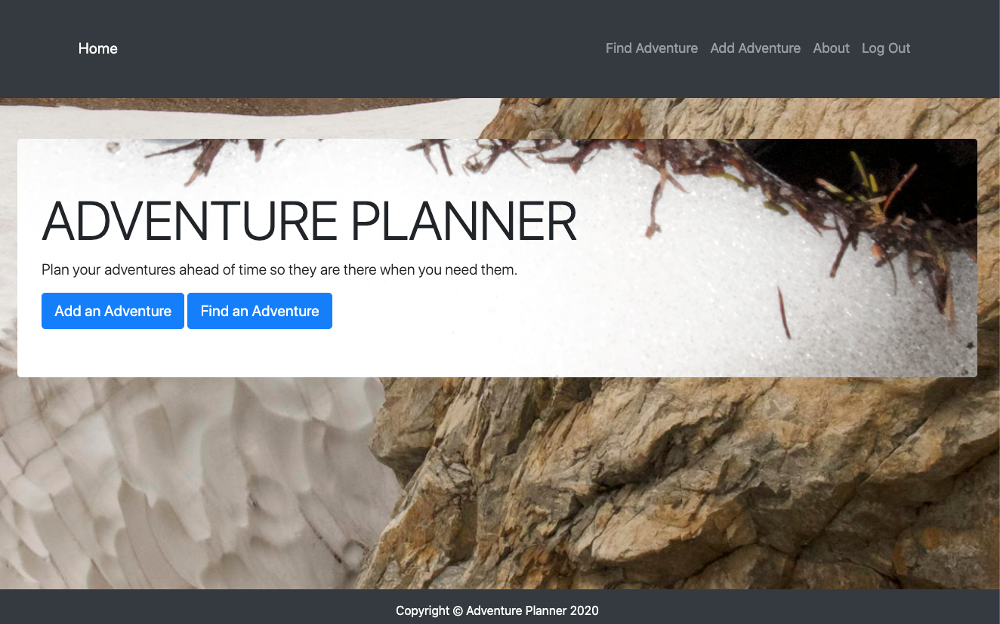
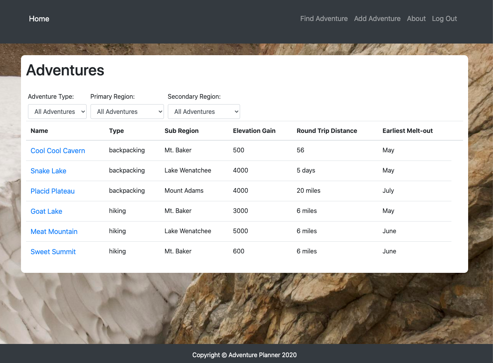
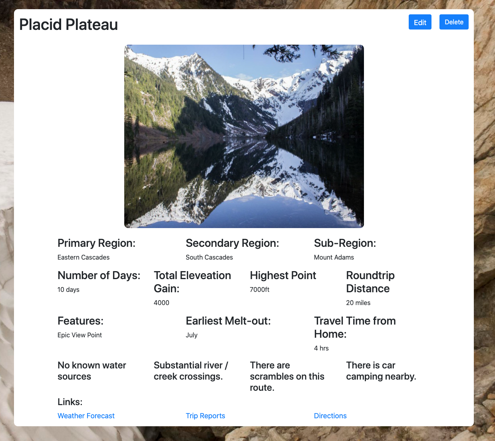

  

Plan a an adventure, or find an adventure that you already planned. Plan your adventures in the winter and don't waste time during the summer.

## Intro
----
This app is a personal adventure planner that a user can use when researching hikes, or backpacking trips to keep track of critical details. 

## Background
----
This app was built with the main user persona being my own attempts to research different types of adventures. Sites like [Washington Trails Association][1] are great for discovering new hikes and finding reviews, but their feature for allowing users to plan out their own adventures is lacking. The following elements were prelimenary requirements: 
- The user's entries must be private to each user, because researching hikes and backpacking trips is serious business
- The user needs to be able to search for hikes already entered by region or by type of adventure
- The app should be tailored to the user's geography- The app's current version is specific to the Pacific Northwest
- The user should be able to store a photo and useful links for more context and planning
- The user must be able to add different adventures related to the current one, just in case a hike could also be a backpacking trip and visa-versa

## Planning 
----
This project was planned out using [Trello][2] to list out user stories, progress, and to link to wireframes and ER diagrams.

#### Wireframes
----
Project wireframs were sketched out using [Moqups][3] for basic page rendering.  
![Wire]

#### ER Diagram
----
This project's ER diagram was sketched out [here][4] using Lucid Chart. 

## Screenshots
---
Landing Page  
  
OAuth Sign-In  
  
Dashboard  
  
Index Page  
  
Create New Adventure    
  
Edit an Adventure  

Show Page  
  

## Technologies Used
---
- JavaScript
- HTML
- CSS
- Node
- Express
- Mongoose
- Google OAuth API

## Getting Started
----

## Next Steps / Ice Box
----

There are a number of items in the [ice box][2] for this project. Since planning is based on weather, a nice weather map will feature on the dashboard to help the user in choosing an adventure they have already planned. Other items of note:
- Comments for keeping notes
- Cataloging adventures that have already been experienced
- New types of adventures, such as alpine scrambles and rock climbing
- A feature for notifying emergency contacts of adventure plans 

[1]: http://www.wta.org
[2]: https://trello.com/b/VRXEu1fN/hiking-adventure-planner-project-2
[3]: https://app.moqups.com/c8MML1R5WD/view/page/a649d360b
[4]: https://lucid.app/lucidchart/fde5f0ef-9576-40c5-9f2b-0c331c32f164/view?page=0_0#?folder_id=home&browser=icon
